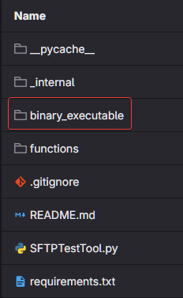
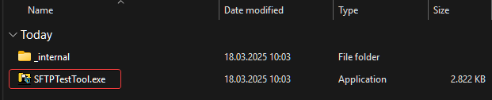
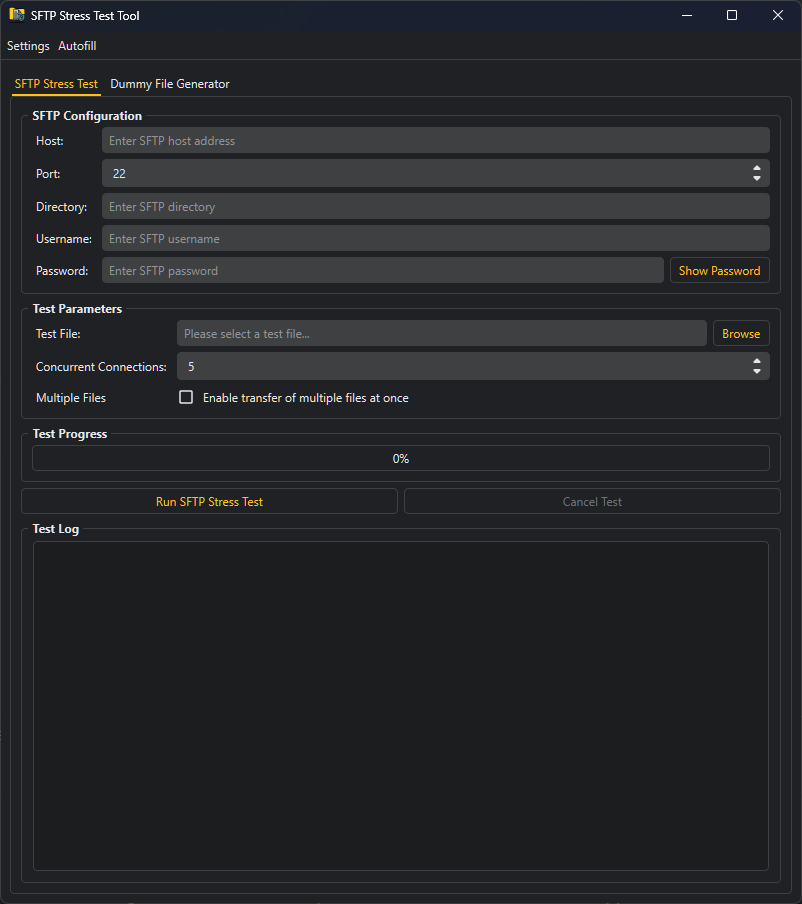

# SFTP-Stresstest-Tool

Tool zum Testen der Leistung und Zuverlässigkeit von SFTP-Servern unter verschiedenen Lastbedingungen.

## Überblick

Mit dem SFTP Stress Test Tool können Benutzer SFTP-Server einem Benchmarking und Stresstest unterziehen, indem sie mehrere gleichzeitige Verbindungen und Dateiübertragungen simulieren.

Das Tool hilft bei der Ermittlung von Leistungsengpässen, Verbindungsgrenzen und der allgemeinen Serverstabilität.

## Download

Kompilierte Windows executable befindet sich unter:

Direkter download [**Hier klicken**](https://git.de.geis-group.net/lobster-administration/python/sftp-stress-test-tool/-/raw/main/binary_executable/SFTPTestTool.7z)

`7z` Datei `SFTPTestTool.7z` herunterladen und entpacken in einem Ordner.

___

## Funktionen

### SFTP-Konfiguration

- Verbindung zu jedem SFTP-Server mit Standard-Authentifizierung

- Anpassbare Port-Auswahl (Standard: 22)

- Angabe des Verzeichnispfads für Dateiübertragungen

### Test-Parameter

- Auswahl bestimmter Testdateien für die Übertragung

- Konfiguration der Anzahl der gleichzeitigen Verbindungen (1-100)

- Mögliche Aktivierung mehrere Dateiübertragungen gleichzeitig

### Zusätzliche Tools

- Integrierter Dummy-Dateigenerator zur Erstellung von Testdateien

- Autofill-Funktion für häufig verwendete Konfigurationen, erweiterbar unter "Settings"

## Verwendung

- Details des SFTP-Servers eingeben (Host, Port, Verzeichnis, Benutzername, Passwort)

- Eine Testdatei auswähle oder eine oder mehrere Dummy-Dateien erzeugen (optional)

- Testparameter Konfigurieren (gleichzeitige Verbindungen, mehrere Dateiübertragungen)

- Mit dem klick  auf "Run SFTP Stress Test", wird der Prozess gestartet

## Screenshot

